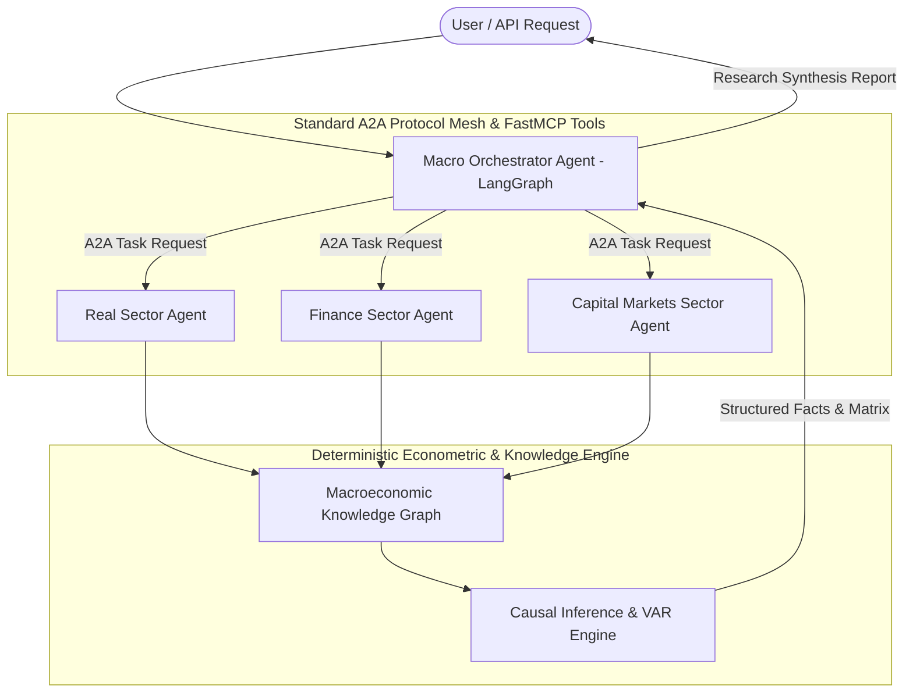

# Multi-Agent Indian Macroeconomic Intelligence Platform — AGENTS.md

## System Overview
Macrograph AI is a research-oriented, production-grade Multi-Agent Macroeconomic Intelligence Platform specialized in the Indian economy. It unifies high-frequency and official statistical data from MoSPI, RBI, SEBI, AMFI, FRED, and the World Bank with causal econometric inference, ontological knowledge graphs, and LangGraph multi-agent orchestration.

---

## Agent Taxonomy & Responsibilities

---

## 1. Macro Orchestrator Agent (`macro_orchestrator`)
* **Role**: Central goal-oriented decomposition, dynamic agent discovery, parallel A2A dispatch, cross-sector causal synthesis, and source-attributed report generation.
* **LLM Engine**: Groq Cloud
  * *Routing / Decomposition*: `llama-3.1-8b-instant` (ultra-low latency, token efficient)
  * *Deep Synthesis / Causal Narrative*: `llama-3.3-70b-versatile` (with auto-fallback to 8B on 429 rate limit)
* **Orchestration**: LangGraph StateGraph with checkpointing and Server-Sent Events (SSE) streaming.

---

## 2. Real Sector Macroeconomic Agent (`real_sector_agent`)
* **Role**: Ingests, processes, and analyzes core physical economy data (National Accounts, Industrial Output, Prices, Agriculture).
* **Protocol**: A2A Agent Card (`/.well-known/agent.json`), FastMCP Tool Server.
* **FastMCP Tools**:
  1. `get_national_income_snapshot`: Real GDP (constant prices), Nominal GDP (current prices), Gross Fixed Capital Formation (GFCF).
  2. `get_industry_snapshot`: Index of Industrial Production (IIP) use-based indicators and manufacturing output.
  3. `get_prices_snapshot`: Headline CPI, Core CPI, Food CPI, Wholesale Price Index (WPI), House Price Index.
  4. `get_agriculture_snapshot`: Foodgrain production volume, crop yield, and Minimum Support Prices (MSP).
* **Data Sources**: MoSPI, RBI Database on Indian Economy (DBIE), Ministry of Agriculture.

---

## 3. Finance Sector Macroeconomic Agent (`finance_sector_agent`)
* **Role**: Monitors monetary policy transmission, banking system health, fiscal sustainability, and external sector liquidity.
* **Protocol**: A2A Agent Card, FastMCP Tool Server.
* **FastMCP Tools**:
  1. `get_gdp_growth_snapshot`: Real GDP growth rates from MoSPI data service.
  2. `get_cpi_inflation_snapshot`: Headline Consumer Price Index inflation against RBI tolerance bands (2%–6%).
  3. `get_repo_rate_snapshot`: RBI Policy Repo Rate, Standing Deposit Facility (SDF), Marginal Standing Facility (MSF), Cash Reserve Ratio (CRR).
  4. `get_debt_to_gdp_snapshot`: General Government Debt-to-GDP ratio for fiscal debt sustainability.
  5. `get_forex_reserves_snapshot`: Foreign Exchange Reserves (Billion USD) and import cover buffers.
* **Data Sources**: MoSPI PowerBI API, RBI, IMF International Financial Statistics, FRED, World Bank.

---

## 4. Capital Markets Sector Agent (`capital_markets_agent`)
* **Role**: Ingests and interprets financial market movements, volatility regimes, corporate earnings health, and institutional liquidity.
* **Protocol**: A2A Agent Card, FastMCP Tool Server.
* **FastMCP Tools**:
  1. `get_equity_snapshot`: NIFTY 50 and SENSEX price momentum and returns.
  2. `get_vix_snapshot`: India VIX volatility regime classification and risk-off signals.
  3. `get_earnings_snapshot`: Aggregate corporate EPS, PAT growth, and margin trends.
  4. `get_primary_market_snapshot`: IPO issuance volume and corporate debt mobilization.
  5. `get_mf_flows_snapshot`: Domestic Institutional Investor (DII) and Mutual Fund net flows from verified AMFI/SEBI data feeds.
* **Data Sources**: NSE India, BSE, AMFI, SEBI Bulletins, Yahoo Finance.

---

## Best Practices & Operational Rules

1. **Virtual Environment**: All operations, tests, and servers must run strictly under `.venv\Scripts\activate`.
2. **Zero Hardcoded Data**: Never hardcode indicator values, dates, or fake live numbers. When feeds are unavailable, return structured status with verified historical snapshots and exact timestamps.
3. **Deterministic Math**: LLMs must never compute math; statistical transformations (Z-scores, momentum, quantiles) are calculated in Python/DuckDB.

