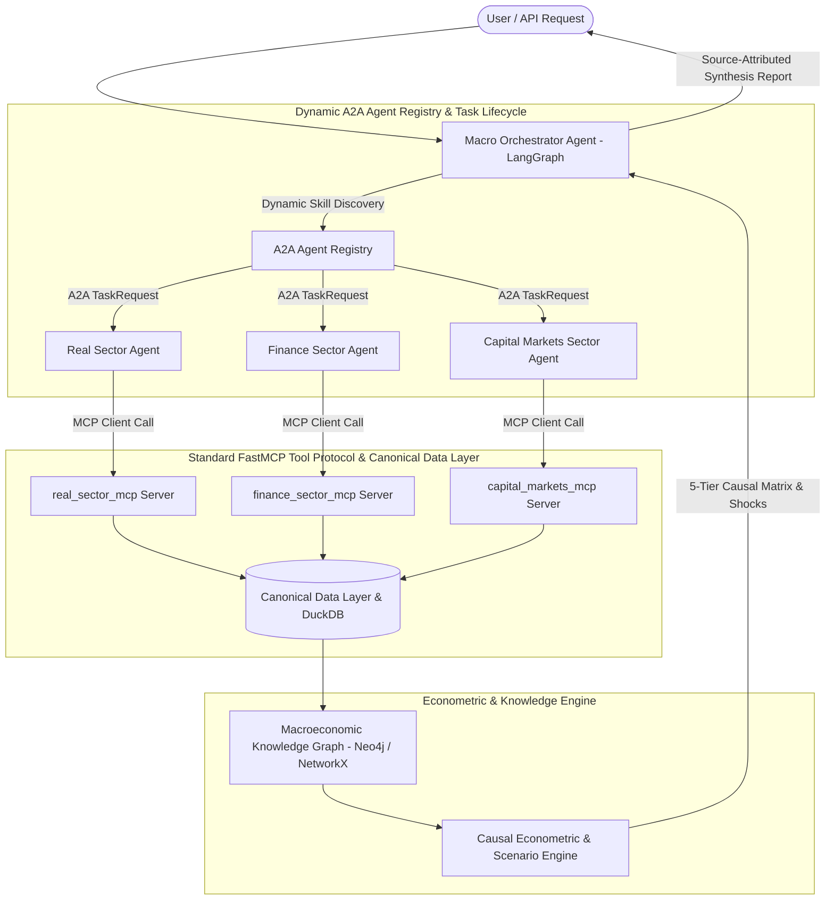

# Multi-Agent Indian Macroeconomic Intelligence Platform — AGENTS.md

## System Overview
Macrograph AI is an academically rigorous, research-oriented, production-grade Multi-Agent Macroeconomic Intelligence Platform specialized in the Indian economy. It unifies high-frequency statistical data from MoSPI, RBI, SEBI, AMFI, IMF, and the World Bank with causal econometric inference, persistent Neo4j/NetworkX knowledge graphs, and LangGraph multi-agent orchestration.

---

## Architectural Flow & Agent Responsibilities

---

## 8 Domain Agent Capabilities Exposed Through the A2A Agent Registry

1. **Real Economy Domain**: Real GDP (Constant prices), Nominal GDP, GFCF Investment, IIP Manufacturing.
2. **Prices & Inflation Domain**: Headline CPI, Consumer Food CPI, Wholesale Price Index (WPI), Brent Crude Oil benchmark.
3. **Monetary & Banking Domain**: RBI Policy Repo Rate, Standing Deposit Facility (SDF), Cash Reserve Ratio (CRR), Bank Credit Growth.
4. **Fiscal Sector Domain**: General Government Debt-to-GDP, Central Government Capex, Gross Tax & GST Collections.
5. **External Sector Domain**: Foreign Exchange Reserves ($ Billion USD), USD/INR Spot Exchange Rate, Merchandise Trade Balance, Current Account Deficit (CAD).
6. **Capital Markets Domain**: NIFTY 50, BANKNIFTY, India VIX Volatility Regime, Corporate Earnings (TTM EPS / PAT), DII/Mutual Fund Flows.
7. **Agriculture & Rural Domain**: Foodgrain Production Volume, Minimum Support Prices (MSP), Monsoon LPA % Departure.
8. **Labour & Employment Domain**: Monthly Net EPFO Payroll Additions, PLFS Unemployment Rate.

---

## 5-Tier Causal Classification Taxonomy

Every transmission edge in the Knowledge Graph is categorized into one of five rigorous tiers:
1. `THEORY`: Qualitative economic theory consensus supported by academic literature.
2. `STATISTICAL_ASSOCIATION`: Contemporaneous empirical correlation with verified $p$-value.
3. `LAGGED_RELATIONSHIP`: Cross-correlation with optimal transmission lag ($k \in [1, 12]$ months).
4. `GRANGER_PREDICTIVE`: Statistical $F$-test predictive causality ($p < 0.05$).
5. `STRUCTURAL_CAUSAL_MODEL`: Causal relationship represented using an explicit SCM/DAG with documented assumptions and identification conditions.

---

## Operational Guardrails & Best Practices

1. **Virtual Environment**: All operations, tests, and servers must run strictly under `.venv\Scripts\activate`.
2. **Decoupled Ingestion**: Agents do not scrape or clean raw data; they query the clean, validated Canonical Data Layer.
3. **Zero Hardcoded Data**: Never hardcode indicator values, dates, or fake live numbers. When feeds are unavailable, return structured status with verified historical snapshots and exact timestamps.
4. **Deterministic Math**: LLMs must never compute math; statistical transformations (Z-scores, momentum, quantiles) are calculated in Python/DuckDB.
