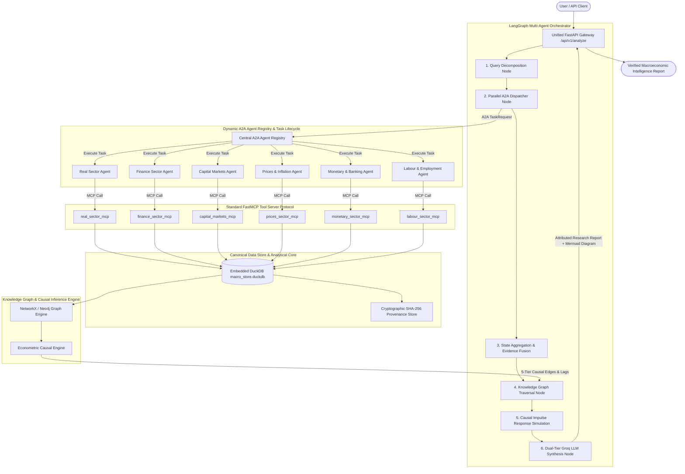

# Multi-Agent Indian Macroeconomic Intelligence Platform — AGENTS.md

## 1. System Overview & Mission Statement
**Macrograph AI** is an academically rigorous, research-oriented, production-grade Multi-Agent Macroeconomic Intelligence Platform specialized in the Indian economy. It unifies high-frequency statistical data from official authorities (MoSPI, RBI, SEBI, AMFI, IMF, and World Bank) with causal econometric inference, persistent Neo4j/NetworkX knowledge graphs, FastMCP tool servers, and LangGraph multi-agent orchestration.

The platform is designed to eliminate speculative LLM hallucinations by enforcing:
1. **Separation of Concerns**: LLMs provide qualitative economic synthesis, query routing, and narrative explanation; deterministic analytical engines (Python, DuckDB, SciPy, Statsmodels) compute statistical metrics, Z-scores, momentum, and causal shock propagations.
2. **Decoupled Agent-to-Agent (A2A) Protocol**: Standardized JSON-RPC/REST message passing between autonomous domain agents with strict Pydantic schema validation.
3. **Model Context Protocol (MCP)**: FastMCP servers providing granular tool execution over clean canonical data stores.
4. **Cryptographic Provenance**: Every empirical data point carries a SHA-256 provenance hash, publication timestamp, source authority citation, and revision status.

---

## 2. End-to-End Architectural Flow



---

## 3. The 8 Macroeconomic Domain Agents & Capabilities

Each domain agent operates autonomously, advertising discoverable skills via its `AgentCard` and executing tasks through standardized inputs/outputs.

### 1. Real Economy Domain Agent
- **Canonical Indicators**:
  - `in.macro.real.gdp_growth`: Real GDP at Constant (2011-12) Prices (% YoY).
  - `in.macro.real.iip_growth`: Index of Industrial Production use-based and manufacturing growth (% YoY).
  - `in.macro.real.gfcf_investment`: Gross Fixed Capital Formation (% of GDP).
- **Core Authority**: Ministry of Statistics and Programme Implementation (MoSPI).
- **Analytical Methods**: Rolling 10-year percentile ranking, seasonal adjustments, cyclical component extraction via Hodrick-Prescott filter.
- **MCP Tools**: `get_national_income_snapshot()`, `get_industry_snapshot()`.

### 2. Prices & Inflation Domain Agent
- **Canonical Indicators**:
  - `in.macro.prices.cpi_headline`: All India CPI Combined Headline Inflation (% YoY).
  - `in.macro.prices.cpi_food`: Consumer Food Price Index Inflation (% YoY).
  - `in.macro.prices.wpi_all`: Wholesale Price Index (WPI) All Commodities (% YoY).
  - `in.macro.prices.brent_crude`: Brent Crude Oil Spot Price (USD/barrel).
- **Core Authority**: MoSPI, Office of Economic Adviser (DPIIT), Global Commodity Markets.
- **Analytical Methods**: Food-headline divergence analysis (supply shock vs. broad demand-pull), pass-through elasticity from international crude to domestic WPI/CPI.
- **MCP Tools**: `get_cpi_snapshot()`, `get_wpi_snapshot()`, `get_crude_oil_snapshot()`.

### 3. Monetary & Banking Domain Agent
- **Canonical Indicators**:
  - `in.macro.monetary.repo_rate`: RBI Policy Repo Rate (% p.a.).
  - `in.macro.monetary.standing_deposit_facility`: SDF Standing Deposit Facility (% p.a.).
  - `in.macro.monetary.cash_reserve_ratio`: Cash Reserve Ratio (CRR, % of NDTL).
  - `in.macro.monetary.bank_credit_growth`: Scheduled Commercial Banks Non-Food Credit Growth (% YoY).
- **Core Authority**: Reserve Bank of India (RBI DBIE).
- **Analytical Methods**: Real Policy Rate calculation ($\text{Repo} - \text{Headline CPI}$), Monetary Policy Stance scoring, Liquidity Adjustment Facility (LAF) net deficit/surplus analysis.
- **MCP Tools**: `get_repo_rate_snapshot()`, `get_credit_growth_snapshot()`.

### 4. Fiscal Sector Domain Agent
- **Canonical Indicators**:
  - `in.macro.fiscal.debt_to_gdp`: General Government Debt-to-GDP Ratio (% of GDP).
  - `in.macro.fiscal.central_capex_growth`: Central Government Capital Expenditure Growth (% YoY).
  - `in.macro.fiscal.gross_tax_growth`: Gross Tax Collections & GST Revenue Run-rate (% YoY).
- **Core Authority**: Ministry of Finance, Controller General of Accounts (CGA).
- **Analytical Methods**: Fiscal consolidation trajectory assessment against FRBM targets, capex multiplier estimation.
- **MCP Tools**: `get_debt_to_gdp_snapshot()`.

### 5. External Sector Domain Agent
- **Canonical Indicators**:
  - `in.macro.external.forex_reserves`: Foreign Exchange Reserves ($ Billion USD).
  - `in.macro.external.usd_inr_exchange_rate`: USD/INR Spot Reference Rate.
  - `in.macro.external.merchandise_trade_deficit`: Monthly Merchandise Trade Balance ($ Billion USD).
  - `in.macro.external.current_account_deficit`: CAD as % of GDP.
- **Core Authority**: Reserve Bank of India, Ministry of Commerce.
- **Analytical Methods**: Import cover buffer adequacy (months of imports), REER/NEER valuation divergence, currency volatility buffering.
- **MCP Tools**: `get_forex_reserves_snapshot()`.

### 6. Capital Markets Domain Agent
- **Canonical Indicators**:
  - `in.macro.capmarkets.nifty_50`: NIFTY 50 Index valuation, P/E multiple, and returns.
  - `in.macro.capmarkets.india_vix`: India VIX volatility regime index.
  - `in.macro.capmarkets.corporate_earnings_growth`: Corporate earnings growth (TTM EPS / PAT).
  - `in.macro.capmarkets.dii_mutual_fund_flows`: Domestic Institutional Investor (DII) and Mutual Fund net equity inflows (INR Crore).
- **Core Authority**: National Stock Exchange (NSE), SEBI, AMFI.
- **Analytical Methods**: Volatility regime categorization ($<15$ Low, $15-22$ Normal, $>22$ High/Stress), domestic liquidity absorption cushion against foreign capital flight.
- **MCP Tools**: `get_equity_snapshot()`, `get_vix_snapshot()`, `get_earnings_snapshot()`, `get_primary_market_snapshot()`, `get_mf_flows_snapshot()`.

### 7. Agriculture & Rural Domain Agent
- **Canonical Indicators**:
  - `in.macro.agri.foodgrain_production`: Total Foodgrain Production Volume (Million Tonnes).
  - `in.macro.agri.minimum_support_price_growth`: Kharif & Rabi Minimum Support Price (MSP) hike (% YoY).
  - `in.macro.agri.monsoon_departure`: IMD Southwest Monsoon Long Period Average (LPA) % Departure.
- **Core Authority**: Ministry of Agriculture & Farmers Welfare, India Meteorological Department (IMD).
- **Analytical Methods**: Spatial rainfall anomaly mapping, seasonal crop acreage projection, rural wage-price inflation spiral detection.
- **MCP Tools**: `get_agriculture_snapshot()`.

### 8. Labour & Employment Domain Agent
- **Canonical Indicators**:
  - `in.macro.labour.epfo_additions`: Net Monthly EPFO Payroll Additions (Number of workers).
  - `in.macro.labour.unemployment_rate`: Periodic Labour Force Survey (PLFS) Unemployment Rate (%).
- **Core Authority**: Employees' Provident Fund Organisation (EPFO), MoSPI.
- **Analytical Methods**: Formal sector employment momentum, youth unemployment ratio, formalization rate vs. informal rural shift.
- **MCP Tools**: `get_epfo_payroll_snapshot()`.

---

## 4. Central Macro Orchestrator Agent (LangGraph)

The Orchestrator coordinates multi-agent research through a deterministic Directed Acyclic Graph (DAG) implemented in LangGraph:

1. **`decompose_node`**: Deconstructs user queries into domain tasks and maps targeted sectors using semantic keyword matching and ontology taxonomy.
2. **`parallel_a2a_execute_node`**: Queries the `AgentRegistry` dynamically, constructs validated `TaskRequest` payloads, dispatches them asynchronously across domain executors, and aggregates `A2AArtifact` results.
3. **`kg_causal_enrichment_node`**: Extracts canonical indicator IDs from collected observations, discovers shortest transmission paths in NetworkX, executes econometric shock simulations if a shock is specified, and renders dynamic Mermaid flowcharts.
4. **`synthesis_node`**: Invokes the dual-tier Groq LLM client (`llama-3.3-70b-versatile` with exponential backoff and fallback to `llama-3.1-8b-instant`, or deterministic local synthesis) to generate an academic, source-attributed research report.

---

## 5. Standard Agent-to-Agent (A2A) Protocol Specification

Communication between the Orchestrator and domain agents strictly adheres to the A2A Protocol (`core/protocols/a2a/`):

### `AgentCard` Schema
```json
{
  "name": "Finance Sector Macroeconomic Agent",
  "version": "1.0.0",
  "description": "Monitors monetary policy stance, liquidity buffers, and fiscal sustainability.",
  "endpoint": "http://localhost:8000/finance-sector/a2a",
  "skills": [
    {
      "name": "get_repo_rate_snapshot",
      "description": "Fetches current RBI Policy Repo Rate and monetary stance.",
      "parameters": {}
    }
  ],
  "input_schema": { "type": "object", "properties": { "query": { "type": "string" } } },
  "output_schema": { "type": "object", "properties": { "observations": { "type": "array" } } }
}
```

### `TaskRequest` & `TaskResponse` Lifecycle
- **`TaskState`**: `SUBMITTED` $\rightarrow$ `WORKING` $\rightarrow$ `COMPLETED` | `FAILED`.
- **Artifacts**: Every response contains one or more `A2AArtifact` items:
  - `name`: Identifier of the artifact (e.g., `real_sector_indicators.json`).
  - `type`: MIME/Data type (`json`, `markdown`, `csv`).
  - `content`: Structured analytical observations and metrics.
  - `metadata`: Cryptographic hashes (`sha256`) and timestamps for auditing.

---

## 6. FastMCP Tool Protocol Specification

All domain tools are exposed via official FastMCP servers (`fastmcp`):

| MCP Server | Exposed Tool Name | Description | Key Parameters |
| :--- | :--- | :--- | :--- |
| `real_sector_mcp` | `get_national_income_snapshot` | Quarterly Real/Nominal GDP, GFCF | `start_date`, `end_date` |
| `real_sector_mcp` | `get_industry_snapshot` | IIP use-based and manufacturing | `start_date`, `end_date` |
| `real_sector_mcp` | `get_prices_snapshot` | CPI, Food CPI, WPI, House Price Index | `start_date`, `end_date` |
| `real_sector_mcp` | `get_agriculture_snapshot` | Foodgrain volume, crop yields, MSP | `start_date`, `end_date` |
| `finance_sector_mcp` | `get_gdp_growth_snapshot` | MoSPI Real GDP growth rate | `prices` ("Constant" / "Current") |
| `finance_sector_mcp` | `get_cpi_inflation_snapshot` | Headline CPI against RBI tolerance band | None |
| `finance_sector_mcp` | `get_repo_rate_snapshot` | RBI Policy Repo Rate, SDF, MSF, CRR | None |
| `finance_sector_mcp` | `get_debt_to_gdp_snapshot` | General Government Debt-to-GDP | None |
| `finance_sector_mcp` | `get_forex_reserves_snapshot` | FX Reserves in Billion USD & import cover | None |
| `capital_markets_mcp` | `get_equity_snapshot` | NIFTY 50 and SENSEX returns & valuation | `include_source_metadata` |
| `capital_markets_mcp` | `get_vix_snapshot` | India VIX levels and regime classification | `include_source_metadata` |
| `capital_markets_mcp` | `get_earnings_snapshot` | Corporate earnings growth (EPS/PAT) | `include_source_metadata` |
| `capital_markets_mcp` | `get_primary_market_snapshot` | IPO counts and corporate debt mobilization | `include_source_metadata` |
| `capital_markets_mcp` | `get_mf_flows_snapshot` | DII and mutual fund net equity flows | `include_source_metadata` |
| `prices_sector_mcp` | `get_cpi_snapshot` | CPI headline inflation snapshot | `indicator` |
| `prices_sector_mcp` | `get_wpi_snapshot` | WPI all commodities inflation snapshot | `indicator` |
| `prices_sector_mcp` | `get_crude_oil_snapshot` | Brent crude benchmark spot price | `indicator` |
| `monetary_sector_mcp` | `get_repo_rate_snapshot` | RBI repo rate policy snapshot | `indicator` |
| `monetary_sector_mcp` | `get_credit_growth_snapshot`| Bank credit growth YoY snapshot | `indicator` |
| `labour_sector_mcp` | `get_epfo_payroll_snapshot` | Monthly net EPFO payroll additions | `indicator` |

---

## 7. 5-Tier Causal Classification Taxonomy

To prevent confounding correlation with causality, every edge in the Knowledge Graph is assigned to one of five rigorous tiers:

```
Tier 1: THEORY
  └─ Pure qualitative economic consensus supported by literature (e.g., higher policy rates cool aggregate demand).
Tier 2: STATISTICAL_ASSOCIATION
  └─ Contemporaneous empirical correlation with verified p-value (p < 0.05).
Tier 3: LAGGED_RELATIONSHIP
  └─ Empirical cross-correlation with documented optimal transmission lag (k in [1, 12] months).
Tier 4: GRANGER_PREDICTIVE
  └─ Directional predictive causality verified by statistical F-test on stationary time-series.
Tier 5: STRUCTURAL_CAUSAL_MODEL (SCM)
  └─ Explicit Directed Acyclic Graph (DAG) with documented counterfactual assumptions and identification conditions.
```

---

## 8. Operational Guardrails & Engineering Best Practices

1. **Virtual Environment Isolation**: All operations, tests, and servers must execute strictly within `.venv\Scripts\activate`.
2. **Zero Fake or Hardcoded Numbers & Live API Mandate**: Never hallucinate, mock, or hardcode values anywhere. All indicator statistics must be fetched dynamically from live official APIs. If data cannot be fetched or an external API is down, the tool/agent must return an explicit structured error (`status: "error"`) with the failure reason rather than falling back to dummy or fabricated numbers.
3. **Deterministic Numerical Computation**: LLMs must NEVER perform mathematical operations (Z-scores, CAGR, standard deviations, or impulse shocks). All math is computed deterministically in DuckDB/Python.
4. **Resilient Synthesis**: If Groq Cloud experiences rate limits (HTTP 429), the LLM client automatically backs off exponentially, falls back from `llama-3.3-70b-versatile` to `llama-3.1-8b-instant`, and ultimately to deterministic offline synthesis without failing the user request.
5. **Continuous Verification**: Any code modification must verify that all 27 unit/integration tests remain passing:
   ```powershell
   .venv\Scripts\pytest backend/tests
   ```
