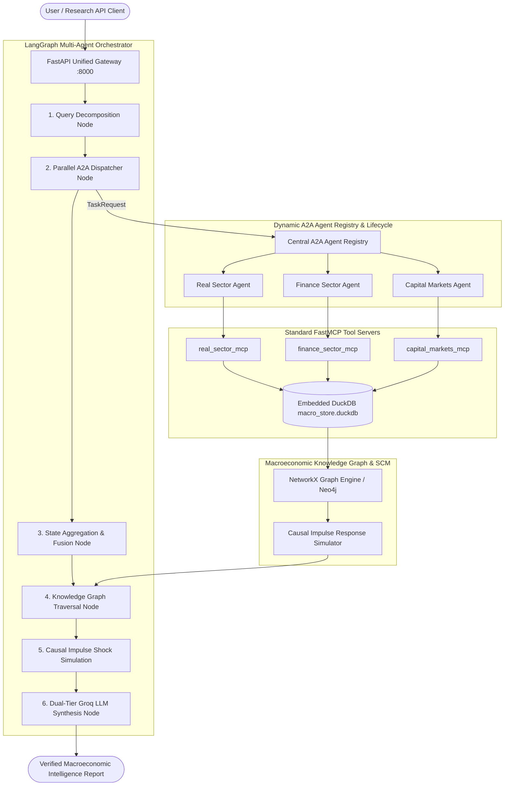

# Macrograph AI — Multi-Agent Indian Macroeconomic Intelligence Platform

[](https://www.python.org/downloads/)
[](https://fastapi.tiangolo.com)
[](https://langchain-ai.github.io/langgraph/)
[](https://duckdb.org)
[](https://github.com/jlowin/fastmcp)
[](https://github.com/google-deepmind)
[]()

**Macrograph AI** is an academically rigorous, research-oriented Multi-Agent Macroeconomic Intelligence Platform specialized in the Indian economy. It bridges official statistical time-series (from MoSPI, RBI DBIE, SEBI, AMFI, and Ministry of Finance) with a persistent **5-Tier Causal Knowledge Graph**, standard **FastMCP** tool protocol servers, **A2A (Agent-to-Agent)** inter-agent message passing, and **LangGraph** multi-agent orchestration.

---

## Key Differentiators & Principles

1. **Separation of Concerns & Hallucination Elimination**: Large Language Models (LLMs) are restricted to qualitative reasoning, query routing, and academic synthesis. All statistical metrics (Z-scores, rolling percentiles, growth rates, and impulse response shocks) are computed deterministically in Python and DuckDB.
2. **5-Tier Causal Classification**: Replaces raw correlations with an explicit 5-tier causal taxonomy (`THEORY`, `STATISTICAL_ASSOCIATION`, `LAGGED_RELATIONSHIP`, `GRANGER_PREDICTIVE`, `STRUCTURAL_CAUSAL_MODEL`).
3. **Cryptographic Provenance**: Every empirical data point carries a SHA-256 hash, official source authority citation, release timestamp, and revision status.
4. **Resilient Dual-Tier LLM Architecture**: Operates on Groq Cloud using `llama-3.3-70b-versatile` for deep causal synthesis and `llama-3.1-8b-instant` for fast query routing, with automatic exponential retry and deterministic offline fallback.

---

## Architectural Flow



---

## The 8 Macroeconomic Domain Sectors

| # | Sector | Canonical ID Prefix | Core Indicators | Source Authority |
| :-: | :--- | :--- | :--- | :--- |
| 1 | **Real Economy** | `in.macro.real.*` | Real GDP Growth, IIP Manufacturing, GFCF Investment | MoSPI |
| 2 | **Prices & Inflation** | `in.macro.prices.*` | Headline CPI, Food CPI, WPI All Commodities, Brent Crude | MoSPI, OEA, EIA |
| 3 | **Monetary & Banking**| `in.macro.monetary.*` | Policy Repo Rate, SDF, CRR, Bank Credit Growth | RBI DBIE |
| 4 | **Fiscal Sector** | `in.macro.fiscal.*` | General Govt Debt-to-GDP, Central Capex, Gross Tax | Ministry of Finance, CGA |
| 5 | **External Sector** | `in.macro.external.*` | Forex Reserves, USD/INR Exchange Rate, Trade Deficit | RBI, Ministry of Commerce |
| 6 | **Capital Markets** | `in.macro.capmarkets.*` | NIFTY 50, India VIX Volatility Regime, Corporate EPS/PAT | NSE, SEBI, AMFI |
| 7 | **Agriculture & Rural** | `in.macro.agri.*` | Foodgrain Production, Minimum Support Prices (MSP) | MoA&FW, IMD |
| 8 | **Labour & Employment** | `in.macro.labour.*` | Net Monthly EPFO Payroll Additions, PLFS Unemployment | EPFO, MoSPI |

---

## 5-Tier Causal Classification Taxonomy

Every transmission edge in the Knowledge Graph is categorized into one of five rigorous tiers:

1. **`THEORY`**: Qualitative macroeconomic theory supported by peer-reviewed academic literature.
2. **`STATISTICAL_ASSOCIATION`**: Contemporaneous empirical correlation with verified $p < 0.05$.
3. **`LAGGED_RELATIONSHIP`**: Empirical cross-correlation with verified transmission lag ($k \in [1, 12]$ months).
4. **`GRANGER_PREDICTIVE`**: Directional predictive causality validated by bivariate $F$-tests on stationary time series.
5. **`STRUCTURAL_CAUSAL_MODEL`**: Structural Causal Model / Directed Acyclic Graph (DAG) with documented assumptions and counterfactual identification conditions.

---

## Quickstart Guide

### 1. Prerequisites & Virtual Environment
Ensure you have Python 3.12+ installed. Activate the project virtual environment:

```powershell
# Windows PowerShell
.venv\Scripts\activate
```

### 2. Environment Configuration
Create a `.env` file in the root or `backend/` directory:

```env
GROQ_API_KEY=your_groq_api_key_here
MODEL_PROVIDER=groq
FAST_MODEL=llama-3.1-8b-instant
REASONING_MODEL=llama-3.3-70b-versatile
LLM_TEMPERATURE=0.1
DATABASE_PATH=macro_store.duckdb
```
*(Note: If no API key is provided, the platform automatically switches to deterministic offline synthesis without failing).*

### 3. Run Automated Tests
Execute the full test suite (27 unit and integration tests):

```powershell
.venv\Scripts\pytest backend/tests -v
```

### 4. Run the Platform Demo
Run the end-to-end multi-agent orchestration demo:

```powershell
.venv\Scripts\python backend/demo_platform.py
```

### 5. Launch the FastAPI Gateway
Start the backend server on `http://127.0.0.1:8000`:

```powershell
.venv\Scripts\uvicorn main:app --app-dir backend --host 127.0.0.1 --port 8000 --reload
```

Interactive OpenAPI documentation will be available at [http://127.0.0.1:8000/docs](http://127.0.0.1:8000/docs).

---

## Core API Endpoints

### 1. Multi-Agent Research Analysis
`POST /api/v1/analyze`
```json
{
  "query": "Assess the impact of rising global crude prices on Indian CPI inflation, RBI repo rate policy, and corporate earnings.",
  "scenario_shock": {
    "name": "Global Brent Crude Oil Surge (+20 USD/barrel)",
    "variable": "in.macro.prices.brent_crude",
    "magnitude": 20.0
  }
}
```
**Response**: Includes verified observations, traversed causal paths, impulse response forecast, dynamic Mermaid diagram, and the synthesized research report.

### 2. Causal Scenario Impulse Simulation
`POST /api/v1/simulate`
```json
{
  "scenario_name": "Monetary Policy Tightening (+50 bps)",
  "shock_variable": "in.macro.monetary.repo_rate",
  "shock_magnitude": 0.50,
  "horizon_periods": 4
}
```

### 3. Knowledge Graph Transmission Path
`GET /api/v1/kg/path?source_id=in.macro.prices.brent_crude&target_id=in.macro.real.gdp_growth`
- Returns: Shortest transmission path, number of hops, cumulative transmission lag (months), and individual edge relationships.

### 4. Downstream Shock Reachability
`GET /api/v1/kg/impacts?shock_id=in.macro.prices.brent_crude`
- Returns: All reachable macroeconomic indicators affected downstream by the shock.

### 5. A2A Agent Registry
`GET /a2a/registry`
- Returns: All discoverable `AgentCard` specifications, registered skills, and input/output schemas.

---

## Project Structure

```text
macrograph-ai/
├── AGENTS.md                   # Multi-agent architecture & agent specifications
├── MEMORY.md                   # System memory, design decisions & data dictionary
├── IMPLEMENTATION_PLAN.md      # Comprehensive implementation plan & roadmap tracker
├── README.md                   # Root project documentation
├── pyproject.toml              # Project dependencies & build configuration
├── macro_store.duckdb          # Embedded DuckDB canonical macroeconomic store
├── .agents/skills/             # Reusable Antigravity agent skills (13 domain skills)
├── backend/
│   ├── main.py                 # Unified FastAPI gateway & route definitions
│   ├── demo_platform.py        # End-to-end platform demonstration script
│   ├── core/
│   │   ├── config.py           # Pydantic platform settings
│   │   ├── data/schema.py      # Canonical data models & enums
│   │   ├── database/           # Embedded DuckDB store implementation
│   │   ├── knowledge_graph/    # NetworkX & Neo4j graph engines & ontology
│   │   ├── econometrics/       # Causal impulse response simulation & Granger test
│   │   ├── protocols/a2a/      # A2A Agent Card, Registry, Task lifecycle & SSE
│   │   ├── protocols/mcp/      # Standard FastMCP client
│   │   └── orchestrator/       # LangGraph multi-agent orchestration & Groq client
│   ├── real_sector/            # Real Sector pipeline, FastMCP server, & A2A executor
│   ├── finance_sector/         # Finance Sector data client, FastMCP, & A2A executor
│   ├── capital_market_sector/  # Capital Markets client, FastMCP, & A2A executor
│   ├── prices_sector/          # Prices & Inflation FastMCP server
│   ├── monetary_sector/        # Monetary & Banking FastMCP server
│   ├── labour_sector/          # Labour & Employment FastMCP server
│   └── tests/                  # 27 unit & integration tests
├── frontend/                   # React + Vite web dashboard (upcoming)
└── docs/                       # University project design documents & proposals
```

---

## Reusable Agent Skills

The platform provides 13 modular, production-grade skills located natively in `.agents/skills/`:
1. `macro-orchestrator-agent`: Goal decomposition, parallel A2A dispatching, and Groq synthesis.
2. `real-sector-agent`: Quarterly GDP, IIP industrial production, and GFCF investment.
3. `prices-inflation-agent`: Headline CPI, food inflation, WPI, and Brent crude pass-through.
4. `monetary-banking-agent`: RBI repo rate, corridor rates, and bank credit growth.
5. `capital-markets-agent`: NIFTY 50, India VIX volatility regimes, and DII/FII flows.
6. `finance-sector-agent`: Macro-financial stability, banking liquidity, and forex buffers.
7. `fiscal-sector-agent`: Debt-to-GDP sustainability, central capex, and tax buoyancy.
8. `external-sector-agent`: Forex reserves, USD/INR exchange rate, and trade deficit.
9. `agriculture-rural-agent`: Foodgrain production, MSP trends, and monsoon departure.
10. `labour-employment-agent`: Monthly net EPFO payroll additions and PLFS unemployment.
11. `causal-econometrics-agent`: Structural Causal Models, 5-tier taxonomy, and shock simulations.
12. `knowledge-graph-agent`: Shortest transmission paths, cumulative lag, and Mermaid flowcharts.
13. `canonical-data-ingestion`: DuckDB ingestion standards, validation, and SHA-256 provenance hashing.

---

## Roadmap & Upcoming Milestones

- **Phase 1 (Complete)**: Canonical Data Layer, DuckDB Store, NetworkX Graph, Causal Simulation, A2A Protocol, 6 FastMCP servers, LangGraph Orchestrator, 27/27 Tests Passing.
- **Phase 2 (Complete)**: Comprehensive AGENTS.md, MEMORY.md, Reusable Skills (13 skills), and Implementation Tracker.
- **Phase 3 (Next)**: Full decoupling of all 8 domain A2A executors and dedicated sub-application routers.
- **Phase 4 (Upcoming)**: Policy Document Vector RAG using Qdrant (semantic indexing of RBI circulars, Union Budget speeches, and Economic Survey chapters).
- **Phase 5 (Upcoming)**: Interactive Web Dashboard in `frontend/` using React, Vite, Plotly, and Cytoscape.js.
- **Phase 6 (Production)**: Multi-container orchestration using Docker Compose.

---

## License & Attribution
Distributed under the MIT License. Developed for research and institutional macroeconomic intelligence on the Indian economy.
