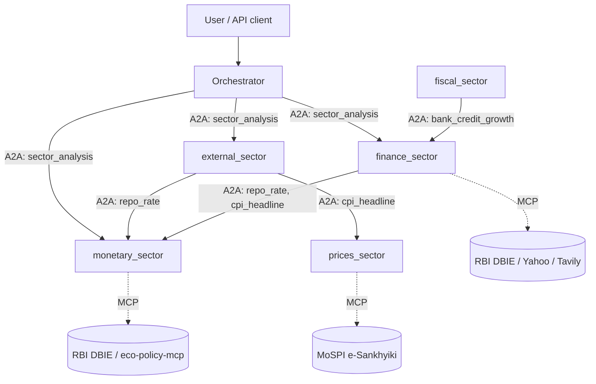
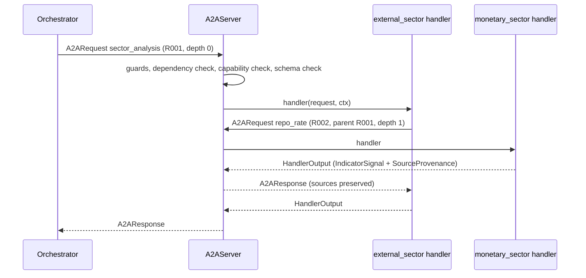

# A2A Architecture

A2A is the agent-to-agent layer of Macrograph-AI. Agents never import or call each other's code. They exchange typed `A2ARequest` / `A2AResponse` envelopes through one server that enforces the protocol rules.

- **A2A** = agent <-> agent (reasoning, delegation, cross-sector indicator requests).
- **MCP** = agent <-> tool or data source (RBI DBIE, MoSPI, Agmarknet, DuckDB, search). Handlers and executors call MCP; A2A never reaches a data source directly.

Code lives in `backend/core/protocols/a2a/`, orchestrator glue in `backend/core/orchestrator/`.

## 1. Architecture



| Module | Responsibility |
| :-- | :-- |
| `messages.py` | Strict Pydantic models: `A2ARequest`, `A2AResponse`, `SourceProvenance`, `A2AErrorInfo`, `HandlerOutput`, `A2ACallContext`, `IndicatorSignal` |
| `models.py` | `AgentCard` (extended), task lifecycle models (existing) |
| `registry.py` | `get_agent`, `find_by_capability`, `list_agents`, executor store |
| `server.py` | `A2AServer.handle()`: guards, authorization, capability and schema validation, timeout, response build |
| `client.py` | `A2AClient`: request creation, discovery, timeout, retry, response validation, context propagation |
| `middleware.py` | `DelegationGuard` (depth, hops, cycles, duplicates) and structured logging |
| `trace.py` | `TraceStore`: reconstructs the delegation graph per `conversation_id` |
| `dependencies.py` | Allowed sector-to-sector edges with rationale |
| `router.py` | Capability routing from Agent Cards |
| `executor_adapter.py` | Exposes every existing `AgentExecutor` as the `sector_analysis` task |
| `peers.py`, `signals.py` | Helpers for sectors requesting or answering peer indicators |
| `provenance.py` | Maps sector citation records to `SourceProvenance` |
| `api.py` | HTTP endpoints under `/a2a/v1` |
| `exceptions.py` | `ErrorCode` enum and exception types |

The transport is a `Transport` protocol. `InProcessTransport` is the default because all agents run inside the one FastAPI gateway; an HTTP transport can replace it without touching callers. No new infrastructure was added.

## 2. Communication flow



Orchestrator flow (`core/orchestrator/graph.py`):

1. `decompose_node` routes the query with `route_query()` over Agent Cards.
2. `parallel_a2a_execute_node` calls `delegate()`: one `sector_analysis` request per routed agent, sent concurrently with `A2AClient.send_many`.
3. Responses that carry `follow_ups` trigger one bounded follow-up round (max 3 per response, linked by `parent_request_id`).
4. `aggregate()` validates and merges results. Failures become `a2a_errors`; the run continues with partial data (`status = a2a_partial`).
5. Knowledge-graph enrichment and synthesis run as before. The report adds an **A2A Source Provenance** table and lists unavailable agents; the synthesis prompt is told which agents did not respond.

`parallel_a2a_execute_node` is sync for `graph.invoke()`; the async `parallel_a2a_execute_async` is used by `ainvoke`.

## 3. Agent Cards

The existing `AgentCard` gained `agent_id`, `supported_tasks`, `input_schema`, `output_schema` and `metadata`. The requested `endpoint` and `authentication` map to the existing `url` and `auth_requirements` fields (no duplicates).

- `agent_id`: stable slug (`finance_sector`) used for addressing.
- `capabilities`, skill `tags`, `metadata["keywords"]`: used for routing.
- `supported_tasks`: A2A task names the agent answers. `A2AServer.register_handler()` appends to it, so the card always matches what is executable.
- `metadata["sector"]`: legacy `SectorEnum` value, used for `target_sectors`.

Cards and keywords are attached at registration in `registry_bootstrap.py` (`SECTOR_SPECS`), the only place that names sector packages.

## 4. Schemas

```python
A2ARequest(request_id, sender_agent, receiver_agent, task, parameters, context,
           conversation_id, parent_request_id, depth, call_chain, timeout_seconds, timestamp)
A2AResponse(request_id, sender_agent, receiver_agent, status: success|partial|failed,
            result, sources: list[SourceProvenance], errors: list[A2AErrorInfo],
            follow_ups, metadata, timestamp)
SourceProvenance(source_url, source_name, dataset, table, reporting_period,
                 retrieved_at, page_or_section, record_reference)
```

All models forbid extra fields. `A2ARequest` is frozen. `depth` and `call_chain` are additions to the requested shape and drive loop protection. Tasks can register `params_model` / `result_model`; the server validates both. Peer indicator tasks use `PeerQuery` and `IndicatorSignal`.

## 5. Registry and routing

```python
registry.get_agent("finance_sector")
registry.find_by_capability("bank_credit_growth")
registry.list_agents()
```

`route_query()` scores each card's capabilities, skill tags and keywords against the query. A term advertised by several agents counts `1/n` for each, so one shared word (for example "rbi") does not pull in unrelated sectors. If no card matches, the LLM (`REASONING_MODEL`, default `openai/gpt-oss-120b` on Groq) may choose, but its answer is intersected with registered agent ids. If that also yields nothing, `A2A_DEFAULT_AGENTS` is used. The LLM cannot bypass A2A: it only selects receivers, and delivery always goes through the server.

## 6. Cross-sector dependencies

Only edges in `dependencies.py` are accepted between sectors; everything else returns `DEPENDENCY_NOT_ALLOWED`. The orchestrator is unrestricted.

| Consumer | Provider | Task | Why |
| :-- | :-- | :-- | :-- |
| finance_sector | monetary_sector | `repo_rate` | WALR/MCLR spreads are measured against the policy rate |
| finance_sector | prices_sector | `cpi_headline` | Real lending and deposit rates need headline CPI |
| fiscal_sector | monetary_sector | `repo_rate` | Interest cost of government borrowing |
| fiscal_sector | prices_sector | `cpi_headline` | Real deficit and revenue buoyancy |
| fiscal_sector | finance_sector | `bank_credit_growth` | Crowding-out of private credit |
| external_sector | monetary_sector | `repo_rate` | Rate differentials drive flows and rupee pressure |
| external_sector | prices_sector | `cpi_headline` | Imported-inflation pass-through, real exchange rate |

These are wired: the Finance, Fiscal and External executors request their peers while loading their own data (`peers.gather_peer_context`), and `finance_agent_node` / `fiscal_agent_node` do the same for direct chat. Peer failures degrade to an "unavailable" line; they never fail the caller.

Relationships suggested in the brief but not wired yet, because the provider has no peer-facing task: Prices <-> Agriculture, Labour <-> Real, Capital Markets <-> Finance, Fiscal <-> Real. They are not allowed by the server until added.

## 7. Provenance

Handlers return `HandlerOutput(sources=[...])`. The server rejects any non-failed response with no sources (`INVALID_RESPONSE`, "No Source, No Answer"). `SourceProvenance` objects pass through the server and client unchanged, so the orchestrator sees the original RBI/MoSPI table, URL and period. For `sector_analysis`, `provenance.py` maps each sector's own citation records; when an artifact has none, it records an artifact-level reference (agent, artifact name, content hash) rather than inventing fields.

## 8. Errors

Failures are returned as `A2AResponse(status="failed")` with `errors=[{code, message, agent}]`; the server and client never raise across agents.

| Code | Meaning |
| :-- | :-- |
| `INVALID_REQUEST` | Bad parameters or malformed call chain |
| `AGENT_NOT_FOUND` / `AGENT_UNAVAILABLE` | Unknown agent / advertised task without a handler |
| `UNSUPPORTED_CAPABILITY` | Task not in the card's `supported_tasks` |
| `DEPENDENCY_NOT_ALLOWED` | Sector edge not declared |
| `MAX_DEPTH_EXCEEDED`, `MAX_HOPS_EXCEEDED`, `CIRCULAR_DELEGATION`, `DUPLICATE_REQUEST` | Loop protection |
| `AGENT_TIMEOUT` | Handler exceeded its timeout (retryable) |
| `DATA_SOURCE_ERROR` | MCP or upstream source failed (`DataSourceError`) |
| `LLM_ERROR` | LLM failure (`LLMError`) |
| `AGENT_ERROR` | Any other handler exception |
| `INVALID_RESPONSE` | Schema violation, missing sources, wrong type, correlation mismatch |
| `TRANSPORT_ERROR` | Delivery failed (retryable) |

Only `AGENT_TIMEOUT` and `TRANSPORT_ERROR` are retried (`A2A_MAX_RETRIES`, exponential backoff, same `request_id`). The orchestrator sends full analyses with `retries=0`.

## 9. Loop protection and traceability

Every request carries `conversation_id`, `request_id`, `parent_request_id`, `depth` and `call_chain`. `A2AClient.build_request(parent=ctx)` derives the child's depth, parent and chain from the handler's `A2ACallContext`.

| Safeguard | Setting |
| :-- | :-- |
| Maximum depth | `A2A_MAX_DEPTH` (5) |
| Maximum requests per conversation | `A2A_MAX_HOPS` (25) |
| Circular delegation (receiver already on `call_chain`) | always on |
| Duplicate request (same sender, parent, receiver, task and parameters, different `request_id`) | always on |
| Timeouts | `A2A_REQUEST_TIMEOUT` (90 s), `A2A_PEER_TIMEOUT` (25 s) |

`GET /a2a/v1/traces/{conversation_id}` returns the flat list and a nested call tree. Traces are in memory, bounded by `A2A_TRACE_MAX_CONVERSATIONS`. Each interaction logs one line on logger `macrograph.a2a`:

```
[A2A] request_id=req-1 conversation_id=conv-1 parent=- sender=orchestrator receiver=finance_sector task=sector_analysis depth=0 status=success errors=- sources=3 duration_ms=412.0
```

## 10. HTTP API

| Endpoint | Purpose |
| :-- | :-- |
| `GET /a2a/v1/agents`, `GET /a2a/v1/agents/{id}` | Agent Cards |
| `GET /a2a/v1/capabilities/{name}` | Agents advertising a capability or task |
| `POST /a2a/v1/requests` | Submit an `A2ARequest`; `sender_agent` must be `gateway` |
| `GET /a2a/v1/traces/{conversation_id}` | Delegation graph |

If `A2A_API_KEY` is set, all `/a2a/v1` calls need header `X-A2A-Key`. With no key, read endpoints stay open but `POST /a2a/v1/requests` is refused (403) unless `A2A_ALLOW_ANONYMOUS_REQUESTS=true`, because it can trigger costly sector analyses. The older `GET /a2a/registry` is unchanged. `/api/v1/analyze` and `/api/v1/chat` now also return `conversation_id` and `a2a_errors`.

## 11. How to

**Add a sector agent.** Write an `AgentExecutor` with `get_agent_card()`, then add a `SectorSpec` to `SECTOR_SPECS` (id, module, class, sector, routing keywords). It is routable immediately through `sector_analysis`; no orchestrator change.

**Expose a capability to peers.** Create `<sector>/a2a_handlers.py`:

```python
async def repo_rate(request: A2ARequest, ctx: A2ACallContext) -> HandlerOutput:
    ...  # call your own MCP/client; raise DataSourceError on failure
    return signal_output(AGENT_ID, [observation], [provenance_from_citation(record.citation, "RBI DBIE")])

def register() -> None:
    a2a_server.register_handler(AGENT_ID, "repo_rate", repo_rate,
                                params_model=PeerQuery, result_model=IndicatorSignal)
```

Bootstrap calls `register()` automatically. To let another sector consume it, add a `SectorDependency` with a rationale, then call `gather_peer_context("<consumer>", parameters, query)` (or `request_peer_signals`) from the consumer.

**Test.** `backend/tests/a2a_helpers.py` builds an isolated `Runtime` (own registry, trace store, server) for protocol tests; `test_a2a_integration.py` uses the real registry with patched data fetchers.

```powershell
pytest backend/tests/test_a2a_protocol.py backend/tests/test_a2a_integration.py -v
```

## 12. Known limits

- Traces and the duplicate-detection state are per process and in memory.
- `sector_analysis` results for markdown-only sectors reach the orchestrator as report text plus artifact-level provenance, not per-indicator citations.
- Only the three peer tasks above exist; adding more is a handler plus a declared dependency.

## Frontend integration

- `POST /api/v1/chat/stream` (orchestrator route) streams one `step` event per A2A request, read live from the trace store. A step carries `request_id` and a `status` (`running`, `completed`, `partial`, `failed`); later events with the same `request_id` update the step in place.
- The final `done` event includes an `a2a` block: `conversation_id`, `routed_agents`, `routing_method`, `status`, `errors`, `sources` and the flat `trace`. `ChatWorkspace` renders it with `A2ATracePanel` (request tree, timings, per-agent failures).
- `GET /a2a/registry` returns Agent Cards plus the declared `dependencies`; `A2ARegistryView` shows agent ids, A2A tasks and the allowed sector-to-sector edges.
- Direct finance and fiscal chats show peer data inside the report ("Peer Signals (A2A)") but do not emit a trace.

