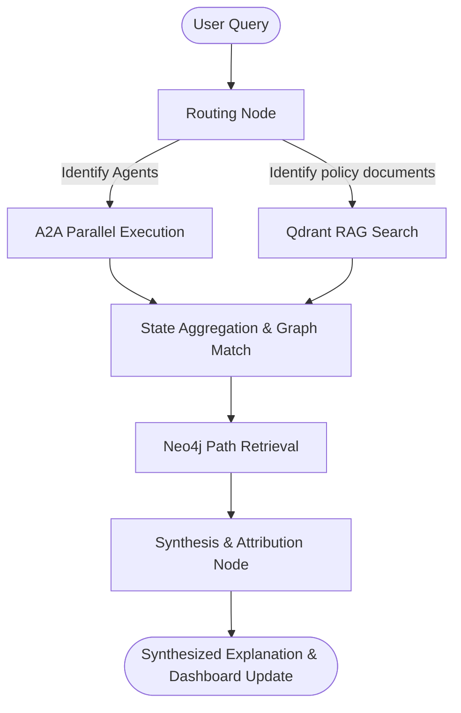

# Multi-Agent Indian Macroeconomic Intelligence Platform - Implementation Plan

An agentic AI system for economic understanding, explainable market analysis, and scenario simulation for the Indian economy, designed as a final year project to be executed over a 2-month period.

## Technology Stack Mapping

*   **Backend Framework:** FastAPI (Python)
*   **Knowledge Graph Database:** Neo4j (for modeling causal macroeconomic relationships)
*   **Vector Database:** Qdrant (for RAG over RBI circulars, SEBI guidelines, Union Budget, and Economic Survey documents)
*   **LLM Engine:** GroqCloud API (accessing models such as `llama-3.1-70b-versatile` or custom specified `openai/gpt-oss-120b` compatible endpoints)
*   **Agent Framework:** LangGraph (for structuring multi-agent state, DAG workflows, and agent execution)
*   **Inter-Agent Communication:** Agent-to-Agent (A2A) Protocol (decoupled JSON-based message passing using Agent Cards and structured task requests/responses, validated using **Pydantic** for JSON Schema validation and type safety)
*   **Model Context Protocol (MCP):** Integrate MCP servers to standardized interfaces allowing the LLM Reasoning Agent to safely query and interact with PostgreSQL, Neo4j, and Qdrant databases, as well as execute system tools.
*   **Explainability:** SHAP (Shapley Additive exPlanations) selectively for key forecasting models (Inflation prediction and Market risk prediction) + LLM Chain-of-Thought for narrative explainability
*   **Caching Layer:** **Redis** (caching LLM prompt completions, vector search segments, graph query subgraphs, and external scraper requests to reduce rate limiting and expensive call latency)
*   **Deployment Configuration:** **Docker Compose** (orchestrating the FastAPI backend container, PostgreSQL database, Neo4j graph database, Qdrant vector database, and Redis caching container)
*   **Development Environment:** Conda environment `ai_env` (`conda activate ai_env`)

---

## Central Agent Orchestration & Coordination Design

The LLM Economic Analyst serves as the central Orchestrator, coordinating user inputs, sub-agent task routing, database retrievals, and final narrative synthesis. This orchestration is structured as a **LangGraph State Graph** with decoupled A2A message exchanges.

### 1. LangGraph State Schema
The central state tracks query lifecycle metrics, agent payloads, and source attributions:
```python
from typing import Annotated, Dict, List, TypedDict
from langchain_core.messages import BaseMessage

class AgentState(TypedDict):
    query: str                       # Original user question
    messages: List[BaseMessage]      # Full chat message history
    active_agents: List[str]         # List of target agents needed for query
    agent_responses: Dict[str, dict] # Structured responses from domain agents (e.g. key-value stats)
    subgraph: List[dict]             # Extracted causal paths from Neo4j
    retrieved_docs: List[dict]       # Relevant passages from Qdrant RAG
    explanation: str                 # Final synthesized answer
    confidence_score: float          # Combined confidence metric
    primary_contributors: List[str]  # Contributors cited in final synthesis
```

### 2. Execution Flow Diagram & Node Graph
The LangGraph workflow consists of distinct phases executed on a directed acyclic graph (DAG):



*   **Routing Node:** The LLM inspects the user query, cross-references active entries in the `AgentRegistry` (supported capabilities listed in Agent Cards), and determines which sub-agents to trigger (e.g., if query is about food prices, triggers `AgricultureAgent` and `InflationAgent`).
*   **A2A Parallel Execution Node:** Sends asynchronous HTTP `TaskRequest` payloads to the selected agents in parallel. Domain agents compute indicators and return structured `TaskResponse` payloads.
*   **Qdrant RAG Search Node:** Performs semantic lookup for policy guidelines matching the query text.
*   **State Aggregation & KG Match Node:** Takes all domain agent metrics, queries the Neo4j Graph DB (via MCP tool) to extract causal links connecting the active indicators, and aggregates them into the state.
*   **Synthesis Node:** Prompt-guided LLM compiles the narrative explanation, computes combined confidence scores, and cites primary contributing agents.

---

## 8-Week Step-by-Step Implementation Timeline

### Week 1: Environment Setup, Database Schema Design & Initial Data Collection
*   **Task 1.1:** Setup project environment. Activate `ai_env` and install core python packages:
    *   `fastapi`, `uvicorn`, `sqlalchemy`, `psycopg2-binary` (PostgreSQL client)
    *   `neo4j` (Neo4j driver), `qdrant-client` (Qdrant driver)
    *   `langgraph`, `langchain`, `langchain-groq` (or generic `openai` compatible client)
    *   `mcp` (Model Context Protocol Python SDK, specifically utilizing `FastMCP`)
    *   `pandas`, `numpy`, `scikit-learn`, `shap` (Data science & Explainability)
    *   `beautifulsoup4`, `requests`, `lxml` (Web scraping)
*   **Task 1.2:** Initialize Git repository and create directory structure:
    ```text
    macrograph-ai/
    ├── backend/
    │   ├── app/
    │   │   ├── core/         # Config, Database setup, Security
    │   │   ├── db/           # PostgreSQL connection and Models
    │   │   ├── scrapers/     # Data ingestion modules
    │   │   ├── mcp/          # MCP Server implementations (PostgreSQL, Neo4j, Qdrant)
    │   │   ├── agents/       # LangGraph agents
    │   │   │   ├── templates/ # Agent Cards & A2A schemas
    │   │   │   └── modules/   # Individual domain agents
    │   │   ├── services/     # Graph Service, RAG Service, Simulation Service
    │   │   └── api/          # FastAPI routes
    │   ├── main.py
    │   └── requirements.txt
    ├── frontend/             # Dashboards and visualization
    ├── data/                 # Raw/cache storage
    └── docs/                 # Documentation & Base papers
    ```
*   **Task 1.3:** Setup PostgreSQL Database. Design schemas for:
    *   `monetary_rates` (Repo, Reverse Repo, CRR, SLR, SDF, MSF, etc.)
    *   `inflation_metrics` (CPI Headline, Food, Fuel, Core, WPI)
    *   `market_prices` (NIFTY 50, BANKNIFTY, VIX, USD/INR, 10Y Yield, Brent Crude)
    *   `agricultural_prices` (Wheat, Rice, Onion, Tomato)
    *   `weather_records` (IMD rainfall anomalies, monsoon data)
*   **Task 1.4:** Implement baseline scrapers for MoSPI CPI database and RBI policy rates.

### Week 2: Advanced Scrapers, Scheduled Tasks & Policy Document Storage
*   **Task 2.1:** Implement Yahoo Finance API scraper for stock indices (NIFTY, BANKNIFTY), exchange rate (USD/INR), yield (10Y G-Sec), and commodity prices (Brent Crude, Gold).
*   **Task 2.2:** Build Agmarknet scraper for daily/weekly wholesale vegetable and grain prices.
*   **Task 2.3:** Create IMD weather data parser using public web sources to index monsoon status and regional rainfall deficits.
*   **Task 2.4:** Build document downloader to fetch PDF and HTML documents:
    *   RBI circulars and Monetary Policy Statements
    *   Union Budget documents (Fiscal deficit tables, budget speeches)
    *   Economic Survey chapters
    *   SEBI circulars
*   **Task 2.5:** Create database seeding script to populate PostgreSQL with historical data (past 2-5 years) for training explainability and correlation models. Set up background task runners (using FastAPI's `BackgroundTasks` or `APScheduler`).

### Week 3: Neo4j Graph DB & Qdrant RAG Pipelines Setup
*   **Task 3.1:** Spin up a local Neo4j Docker container or connect to Neo4j Aura database.
*   **Task 3.2:** Define Neo4j Schema:
    *   **Nodes:** `Indicator` (e.g., Repo Rate, CPI), `Sector` (e.g., Banking, Auto), `Document` (e.g., Budget 2026).
    *   **Relationships:** `POSITIVE_INFLUENCE`, `NEGATIVE_INFLUENCE`, `LAGGED_INFLUENCE`.
    *   Create Neo4j indexes on node names for fast querying.
*   **Task 3.3:** Spin up a local Qdrant container or Qdrant Cloud.
*   **Task 3.4:** Build the RAG Ingestion Pipeline:
    *   Develop a PDF text extractor with semantic chunking (500–800 tokens with 10% overlap).
    *   Select embedding model (e.g., `text-embedding-3-small` from OpenAI or HuggingFace local models).
    *   Insert document chunks into Qdrant collections along with metadata (document source, date, category).
*   **Task 3.5:** Implement backend database services for Neo4j query execution (Cypher query builders) and Qdrant semantic search retrieval.
*   **Task 3.6:** Design and implement MCP Servers for Databases and Tools:
    *   Develop PostgreSQL MCP Server (allowing LLM to inspect tables, describe schemas, and execute read-only queries safely).
    *   Develop Neo4j MCP Server (allowing LLM to query nodes, retrieve paths, and run MATCH patterns).
    *   Develop Qdrant RAG MCP Server (allowing LLM to search semantically and fetch relevant context segments).
    *   Implement standard MCP connection and transport logic under `backend/app/mcp/` using the official `FastMCP` framework (part of `mcp` SDK).
*   **Task 3.7:** Implement **Redis Caching Service**:
    *   Set up connection pool and basic helper functions to query/set values in Redis.
    *   Implement cache decorators or middleware for LLM completions (Groq API), vector search lookups (Qdrant), and complex subgraphs traversals (Neo4j).
    *   Implement cache invalidation schemas or TTL thresholds (e.g. daily/weekly expiration for slow-moving macroeconomic parameters).

### Week 4: Domain Agents - Inter-Agent (A2A) Protocol & Core Financial Agents
*   **Task 4.1:** Establish the A2A (Agent-to-Agent) Protocol structure:
    *   Create base `AgentCard` class using **Pydantic** to define agent metadata, inputs, outputs, and endpoints, ensuring automated JSON Schema generation.
    *   Create **Pydantic** validation models representing `TaskRequest` and `TaskResponse` payloads to enforce runtime JSON Schema validation, data integrity, and strict type safety.
    *   Set up a central `AgentRegistry` registry in FastAPI backend to list and resolve active agents dynamically.
*   **Task 4.2:** Implement **Monetary Policy Agent**:
    *   Inputs: Repo Rate, SDF, MSF, Net Liquidity Position, Call Money Rate.
    *   Outputs: Monetary Tightening Score, Liquidity Stress Index, Rate Hike Probability.
    *   Model: Logistic regression / classification for hike probability based on past weekly spreads.
*   **Task 4.3:** Implement **Inflation Agent**:
    *   Inputs: Headline CPI, WPI, food/fuel/core subcomponents.
    *   Outputs: Inflation Pressure Index, CPI Attribution Scores (using linear models + SHAP values).
*   **Task 4.4:** Implement **Financial Market Agent**:
    *   Inputs: NIFTY 50, BANKNIFTY, VIX, bond yield, USD/INR.
    *   Outputs: Market Risk Index, Sector Sensitivity Scores (using event-window regression models).

### Week 5: Domain Agents - Auxiliary Agents & Sentiment Classifier
*   **Task 5.1:** Implement **Agriculture Agent**:
    *   Inputs: Agmarknet prices, food crop production statistics.
    *   Outputs: Food Inflation Risk Index (calculates price anomaly metrics against 5-year seasonal baselines).
*   **Task 5.2:** Implement **Weather Agent**:
    *   Inputs: IMD rainfall anomalies.
    *   Outputs: Monsoon Risk Score, Rainfall Deficit Index.
*   **Task 5.3:** Implement **Sentiment Agent**:
    *   Inputs: RBI policy text, financial news headlines, SEBI press releases.
    *   Outputs: Sentiment Score (-1 to 1) and topic breakdown.
    *   Technique: Fine-tuned FinBERT or LLM zero-shot classification via API.
*   **Task 5.4:** Implement **Policy Agent**:
    *   Inputs: Budget text, SEBI notifications.
    *   Outputs: Fiscal Stance Score, Regulatory Change Log.
    *   Technique: LLM parsing of budget tables and circular summary extraction.

### Week 6: Knowledge Graph (KG) Agent & LangGraph Orchestrator (LLM Economic Analyst)
*   **Task 6.1:** Implement **Knowledge Graph Agent**:
    *   Computes dynamic edge weights using rolling Pearson correlation and Granger Causality tests on historical indicator data stored in PostgreSQL.
    *   Updates `INFLUENCE` weights in Neo4j (decaying older weights systematically).
*   **Task 6.2:** Set up the main LangGraph Workflow:
    *   Define the conversation state: `UserState` (user query, past chat history, retrieved contexts, executing sub-agent responses).
    *   Implement Orchestrator Node (LLM Economic Analyst): Analyzes user queries, looks up matching agents in `AgentRegistry`, and schedules A2A calls.
*   **Task 6.3:** Integrate RAG, KG, and SQL retrievals into the LangGraph state using MCP:
    *   Utilize MCP protocol tool calls to retrieve relevant paths from Neo4j (e.g., Brent Crude -> USD/INR -> Inflation -> Repo Rate).
    *   Utilize MCP protocol tool calls to retrieve documents from Qdrant and query metrics from PostgreSQL.
*   **Task 6.4:** Prompt LLM Economic Analyst to synthesize all gathered agent metrics, confidence scores, causal chains, and RAG passages into a unified, source-grounded explanation.

### Week 7: Explainability Framework (SHAP) & Scenario Simulation Engine
*   **Task 7.1:** Integrate selective statistical explainability (SHAP):
    *   Calculate SHAP values specifically for key forecasting models: Inflation prediction attribution (food/fuel/core weights) and Market Risk index.
    *   Exclude SHAP calculations from general knowledge graph reasoning, sentiment analysis, and other non-predictive modules.
    *   Expose raw SHAP data through FastAPI endpoints for downstream visualization.
*   **Task 7.2:** Build **Scenario Simulation Engine**:
    *   Allow users to input a shock parameter (e.g. "What if Brent crude rises by 20%?").
    *   Using the Neo4j Causal Graph, run a propagation algorithm: propagate the shock value along weighted causal pathways (e.g. Brent Crude (+20%) -> Import Bill (+12%) -> INR Weakens (+3%) -> Imported Inflation (+1.5%) -> CPI Inflation (+0.8%) -> Repo Rate (+25bps)).
    *   Use the LLM Economic Analyst to generate a narrative prediction of the simulated scenario.
*   **Task 7.3:** Polish the FastAPI REST APIs:
    *   `/api/chat`: Main conversational endpoint.
    *   `/api/dashboard/indicators`: Fetches latest rates, indices, and sentiment data.
    *   `/api/dashboard/graph`: Serves Neo4j nodes and weighted edges.
    *   `/api/simulate`: Shock simulation endpoint.

### Week 8: Frontend Web Dashboard, Integration & Final Testing
*   **Task 8.1:** Set up frontend dashboard in `frontend/` (using React + Vite):
    *   **Main Dashboard View:** Plotly charts for key rates, indices, risk meters.
    *   **Conversational Interface:** Chat window with sources/agent attribution details.
    *   **KG Graph View:** Interactive canvas representing Neo4j graph using `Cytoscape.js` or `vis.js`.
    *   **Scenario Simulator Panel:** Sliders to input shocks and compare baseline vs simulated pathways.
*   **Task 8.2:** End-to-end testing of the agent workflow, RAG pipeline, and graph traversal under `ai_env`.
*   **Task 8.3:** Model prompt tuning and evaluation (verify LLM answer accuracy against RAG docs).
*   **Task 8.4:** Configure deployment and orchestration with **Docker Compose**:
    *   Create multi-stage `Dockerfile` configurations for backend and frontend services.
    *   Create a root `docker-compose.yml` file defining services, persistent volume mounts for Neo4j, Qdrant, PostgreSQL, and Redis databases, network bridges, and configuration healthchecks.
    *   Compile the final report and update deployment documentation.

---

## Verification Plan

### Automated Tests
1.  **Ingestion Tests:** Run unit tests on all scrapers (RBI, MoSPI, Yahoo Finance) to verify JSON parsing.
    ```bash
    pytest backend/tests/test_scrapers.py
    ```
2.  **A2A Protocol Tests:** Validate schema adherence of `TaskRequest` and `TaskResponse` payloads using `pydantic`.
    ```bash
    pytest backend/tests/test_a2a_protocol.py
    ```
3.  **Graph Database Integration Tests:** Verify Cypher queries fetch paths successfully.
    ```bash
    pytest backend/tests/test_neo4j.py
    ```
4.  **RAG / Vector Database Tests:** Test semantic search relevance scores.
    ```bash
    pytest backend/tests/test_qdrant.py
    ```
5.  **MCP Integration Tests:** Validate that the MCP servers for PostgreSQL, Neo4j, and Qdrant process JSON-RPC requests correctly and return the expected tool execution results.
    ```bash
    pytest backend/tests/test_mcp_servers.py
    ```

### Manual Verification
1.  **Macroeconomic Scenario Testing:** Input hypothetical economic shocks in the dashboard and manually trace if the causal paths returned align with theoretical macroeconomics (e.g., higher commodity price -> currency depreciation -> higher inflation -> interest rate hike).
2.  **Conversational Grounding Check:** Ask questions like "Why did banking stocks fall today?" and verify that the response cites the specific agent outputs (Monetary, Market) and shows confidence scores and primary contributors as per design requirements.
3.  **User Experience (UI/UX) Review:** Validate visual charts, responsive layout, interactive sliders, and Neo4j graph rendering.
