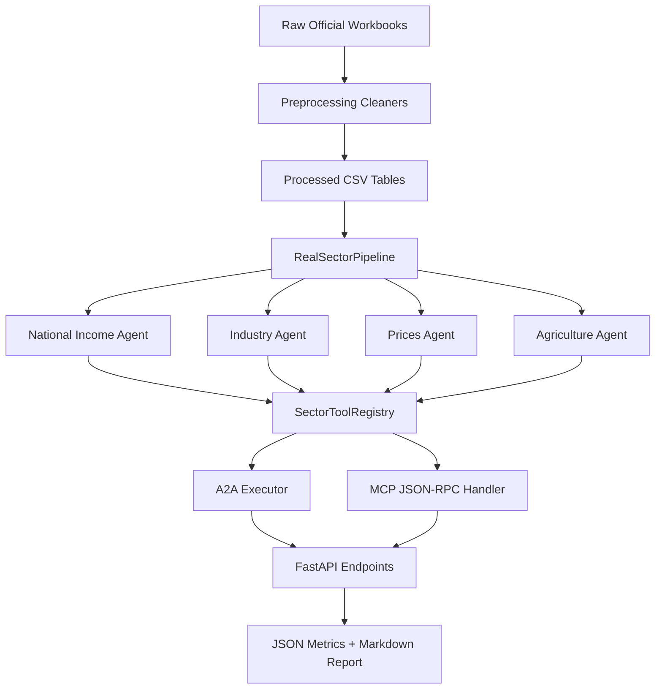

# Review 2 Content: Real Sector Module of MacroGraph AI

## Project Title

**MacroGraph AI: A Multi-Agent Indian Macroeconomic Intelligence Platform with Real Sector Analysis**

## 1. Domain Understanding and Problem Definition

### Domain

The selected domain is **Indian macroeconomic intelligence**, with the current review focused on the **Real Sector** of the economy. The real sector represents the production, income, price, and agriculture side of the economy. It includes indicators such as GDP, industrial production, consumer prices, wholesale prices, foodgrain production, agricultural yield, and minimum support prices.

In MacroGraph AI, the real sector is treated as a core domain because it directly affects inflation, employment, monetary policy, fiscal decisions, financial markets, and household welfare. For example, weak foodgrain production can increase food inflation; higher inflation can influence RBI policy rates; and slower industrial production can affect GDP growth and market sentiment.

### Problem Definition

Macroeconomic data is available from multiple official sources, but it is usually scattered across Excel workbooks, PDFs, dashboards, and government datasets. Students, analysts, and decision makers often face difficulty in:

- collecting macroeconomic data from multiple sources,
- cleaning differently structured files,
- comparing indicators across time,
- understanding causal relationships between indicators,
- generating a concise explanation from large numerical datasets,
- and connecting real-sector indicators with policy or market outcomes.

The problem addressed in this project is:

**To build an AI-assisted macroeconomic intelligence system that can ingest Indian real-sector data, normalize it, compute important indicators, expose them through agent tools, and generate an explainable real-sector macroeconomic report.**

The Real Sector module specifically answers questions such as:

- What is the latest GDP growth trend?
- Is industrial production expanding or slowing?
- Is inflation contained or elevated?
- Is food inflation risk increasing because of agriculture-side pressure?
- What are the major real-sector strengths and vulnerabilities?

### Significance of the Problem

This problem is important because macroeconomic analysis requires both numerical accuracy and interpretability. Traditional dashboards show charts and tables, while general LLMs can generate explanations but may hallucinate values or use outdated information. MacroGraph AI attempts to combine both approaches: deterministic computation from local official datasets and AI-style explanation through structured agent outputs.

The Real Sector Agent therefore improves:

- **clarity**, by dividing the economy into national income, industry, prices, and agriculture;
- **relevance**, by focusing on indicators used in Indian macroeconomic analysis;
- **auditability**, by preserving source metadata;
- **explainability**, by producing structured outputs and human-readable reports;
- **extensibility**, by exposing tools through A2A and MCP protocols.

### Assumptions and Constraints

The current implementation uses locally supplied official workbooks under `backend/real_sector/data/raw`. The system assumes that these source files are valid and periodically refreshed. The pipeline currently works with cleaned CSV outputs before full database deployment. Advanced components such as Neo4j, Qdrant, LangGraph, Redis, and SHAP are planned for later integration after the base data pipeline is stable.

Important constraints include:

- different source files have different frequencies such as monthly, quarterly, and yearly;
- raw government data may contain repeated headers, missing values, and inconsistent date formats;
- inflation series must be carefully distinguished from price-index levels;
- LLMs should not directly compute macroeconomic metrics;
- explanations must be grounded in computed values and source metadata.

## 2. Literature / Patent Review and Analysis of Existing Approaches

The literature review for this project is based on AI agents, economic intelligence, financial question answering, retrieval-augmented generation, knowledge graphs, causality, and financial language models. The project uses literature review rather than patent review because the work is academic and implementation-oriented, and no proprietary patented mechanism is required for the current module.

### Review of Related Work

| Source / Area | Main Idea | Relevance to Project | Limitation / Gap Identified |
| --- | --- | --- | --- |
| Multi-LLM-agent frameworks | Multiple specialized agents collaborate to solve complex tasks | Supports the idea of separate real-sector, finance-sector, and capital-market agents | General frameworks need domain-specific tools and economic data pipelines |
| AI Economist Agent | Uses AI agents for economic reasoning and policy-oriented analysis | Motivates an agentic approach for macroeconomic interpretation | Often focuses on reasoning, while raw data cleaning and source traceability are less emphasized |
| LLM-based Economic Agents | Shows how LLM agents can simulate or interpret economic behavior | Supports natural-language macroeconomic explanation | LLM-only approaches may hallucinate numerical facts without structured data grounding |
| Knowledge Graph-Guided RAG | Combines graph relationships with document retrieval | Supports planned causal graph and policy-document retrieval in MacroGraph AI | Needs a reliable indicator database before graph reasoning is useful |
| Knowledge Graph methods | Represent entities and relationships as nodes and edges | Useful for modeling causal paths such as rainfall -> crop yield -> food CPI -> headline CPI | Requires careful edge design and validation from historical data |
| Causality-inspired financial time-series models | Use causal structure for time-series forecasting and explanation | Supports future causal links between macro indicators and market behavior | Causal inference can be unreliable without enough clean historical data |
| FinBERT | Domain-specific language model for financial sentiment | Useful for future sentiment analysis of RBI, SEBI, and news text | Not directly sufficient for numeric real-sector analysis |
| ReAct | Combines reasoning and tool use in LLM workflows | Supports tool-calling design where the LLM uses deterministic macro tools | Requires strong guardrails to prevent unsupported reasoning |
| Toolformer | Demonstrates how language models can use external tools | Motivates exposing real-sector functions as callable tools | Tool outputs must be validated and structured |
| Metadata-driven RAG for financial Q&A | Uses document metadata to improve retrieval quality | Supports source-aware policy and economic-document search | Retrieval alone does not solve numeric indicator computation |
| Financial report question answering | Extracts answers from financial reports | Relevant for future report-based macro explanation | Does not directly handle time-series macro pipelines |
| TradingAgents | Uses multi-agent LLMs for financial trading analysis | Supports separate analyst roles and synthesis patterns | Market-trading focus is broader than real-sector macro fundamentals |

### Existing Approaches

Most existing approaches fall into three categories:

1. **Traditional economic dashboards**  
   These provide charts and tables but limited natural-language reasoning. They are useful for visual monitoring but do not explain why an indicator changed.

2. **General LLM-based analysis**  
   LLMs can explain concepts well, but they may produce outdated or unverifiable numerical claims if not connected to trusted data.

3. **Data-science pipelines**  
   Python and database-based pipelines can compute accurate indicators, but they are usually not interactive or agent-based.

### Identified Research / Implementation Gap

The main gap is the lack of a system that combines:

- official macroeconomic data ingestion,
- deterministic feature computation,
- domain-specific macro agents,
- structured JSON outputs,
- source metadata,
- protocol-based interoperability,
- and natural-language synthesis.

MacroGraph AI addresses this gap by building a modular multi-agent platform. The Real Sector Agent is the first major domain module and acts as the base for output, production, inflation, and agriculture analysis.

## 3. Objectives, Scope and Expected Outcomes

### Objectives

The main objectives of the Real Sector module are:

1. To collect and organize Indian real-sector datasets related to GDP, industrial production, prices, and agriculture.
2. To preprocess raw official workbooks into normalized tables.
3. To calculate important macroeconomic indicators such as year-on-year growth, period change, rolling averages, and trend direction.
4. To build separate sub-agents for national income, industry, prices, and agriculture.
5. To expose these sub-agents as tools through OpenAI function-style schemas, MCP JSON-RPC, and A2A task execution.
6. To generate an integrated real-sector macroeconomic report.
7. To preserve source metadata for review, debugging, and auditability.

### Scope

The current scope includes:

- Real GDP, nominal GDP, and Gross Fixed Capital Formation;
- IIP use-based growth and manufacturing index;
- headline CPI, food CPI, core CPI, WPI, and house price index;
- foodgrain production, yield, and MSP;
- local raw workbook ingestion;
- processed CSV generation;
- FastAPI endpoints;
- MCP-compatible tool listing and tool calling;
- A2A-compatible agent-card discovery and task execution;
- automated tests for pipeline, tools, MCP, A2A, and API endpoints.

The current scope does not fully include:

- live automatic scraping from every government source;
- complete PostgreSQL deployment;
- Neo4j causal graph execution;
- Qdrant-based policy-document RAG;
- dashboard visualization;
- production deployment through Docker Compose.

These are planned extensions in the larger MacroGraph AI implementation plan.

### Expected Outcomes

At the end of this review stage, the project is expected to demonstrate:

- a working Real Sector data pipeline;
- normalized processed datasets;
- working sub-agents for the four real-sector areas;
- structured JSON responses with economic assessments;
- generated Markdown reports;
- API support through FastAPI;
- protocol readiness through A2A and MCP;
- test coverage for major module behavior;
- a clear path toward knowledge graph, RAG, and full orchestration.

## 4. Proposed Methodology

The methodology follows a staged approach: data first, agents second, and LLM-based explanation later. This ensures that the system is grounded in computed values rather than relying only on generative text.

### Step 1: Data Collection and Storage

The module stores raw official workbooks in:

`backend/real_sector/data/raw`

The raw data is grouped into four folders:

- `Agri`
- `Income`
- `Ind`
- `Prices`

The project maintains raw files separately from processed outputs so that the original data remains unchanged and traceable.

### Step 2: Preprocessing

The preprocessing layer is implemented under:

`backend/real_sector/preprocess`

It contains separate cleaners:

- `agriculture_cleaner.py`
- `income_cleaner.py`
- `industry_cleaner.py`
- `prices_cleaner.py`
- `common.py`

The cleaning process standardizes:

- date formats,
- indicator names,
- sectors and subsectors,
- numeric values,
- frequency,
- units,
- region or state fields,
- and source metadata.

Processed outputs are stored in:

`backend/real_sector/data/processed`

Current processed tables include:

- `agri_msp.csv`
- `agri_production.csv`
- `agri_yield.csv`
- `cpi_combined.csv`
- `gdp_quarterly.csv`
- `house_price_index.csv`
- `industry_iip.csv`
- `industry_manufacturing.csv`
- `wpi_monthly.csv`

### Step 3: Pipeline Service

The `RealSectorPipeline` in `backend/real_sector/services/pipeline.py` controls loading and refreshing of processed data. It calls the four cleaner modules and returns a dictionary of Pandas DataFrames. This central pipeline ensures that all agents use the same data-loading mechanism.

### Step 4: Feature Calculation

Feature calculations are performed in Python under:

`backend/real_sector/features/utils.py`

The system computes:

- latest observation date,
- latest value,
- period change percentage,
- year-on-year change percentage,
- three-period average,
- trend direction,
- latest growth percentage for direct growth series.

This is an important design decision because simple metrics are computed deterministically using code. The LLM or report generator is used only for explanation, not for raw calculation.

### Step 5: Domain Agent Analysis

The Real Sector module uses four specialized agents:

| Agent | File | Function |
| --- | --- | --- |
| National Income Agent | `agents/national_income_agent.py` | Analyzes real GDP, nominal GDP, and GFCF |
| Industry Agent | `agents/industry_agent.py` | Analyzes IIP and manufacturing index |
| Prices Agent | `agents/prices_agent.py` | Analyzes CPI, WPI, core inflation, food inflation, and house prices |
| Agriculture Agent | `agents/agriculture_agent.py` | Analyzes foodgrain production, yield, and MSP |

Each agent returns a structured `SectorResponse` containing:

- agent name,
- assessment,
- indicators,
- alerts,
- source metadata.

### Step 6: Tool Registry

The `SectorToolRegistry` exposes each agent as a callable tool:

- `get_national_income_snapshot`
- `get_industry_snapshot`
- `get_prices_snapshot`
- `get_agriculture_snapshot`

The tool input is validated using Pydantic through `SectorToolInput`. It supports optional date filtering with `start_date` and `end_date`, and can include or exclude source metadata.

### Step 7: A2A and MCP Protocol Integration

The Real Sector Agent supports two interoperability layers:

| Protocol | Purpose |
| --- | --- |
| A2A | Allows the agent to advertise skills and execute tasks through agent-to-agent communication |
| MCP | Allows LLM systems to list and call real-sector tools through JSON-RPC |

The A2A executor is implemented in:

`backend/real_sector/agents/executor.py`

The MCP protocol handler is implemented in:

`backend/real_sector/protocols/mcp_protocol.py`

### Step 8: API Exposure

FastAPI endpoints are implemented in:

`backend/real_sector/api/app.py`

The module supports:

- `GET /.well-known/agent.json`
- `GET /real-sector/agent-card`
- `POST /a2a/tasks`
- `GET /a2a/tasks/{task_id}`
- `POST /a2a/tasks/{task_id}/cancel`
- `POST /mcp`
- `POST /real-sector/mcp`
- `GET /real-sector/tools`
- `POST /real-sector/tools/{tool_name}`
- `POST /real-sector/refresh`

### Step 9: Testing

Automated tests are available in:

`backend/real_sector/tests/test_real_sector.py`

The tests validate:

- source data ingestion,
- tool exposure,
- MCP `tools/list`,
- MCP `tools/call`,
- A2A agent-card generation,
- A2A task execution,
- FastAPI endpoints,
- generation of JSON and Markdown artifacts.

## 5. System Architecture, Module Design and Experimental Design

### Overall Architecture

### Module Organization

| Folder | Role |
| --- | --- |
| `agents` | Contains domain agents, executor, tool registry, and response models |
| `api` | Contains FastAPI application and endpoint definitions |
| `data/raw` | Stores original source files |
| `data/processed` | Stores cleaned CSV outputs |
| `database` | Contains PostgreSQL target schema |
| `features` | Contains reusable summary and trend-calculation utilities |
| `ingest` | Contains Excel reading utilities |
| `preprocess` | Contains source-specific cleaning logic |
| `protocols` | Contains A2A and MCP protocol models |
| `services` | Contains pipeline orchestration service |
| `tests` | Contains automated tests |

### Database Design

The target PostgreSQL schema uses a general table named `real_sector_observations`. It stores:

- sector,
- subsector,
- indicator name,
- date,
- region or state,
- value,
- unit,
- frequency,
- source,
- notes,
- timestamps.

This general schema is flexible because multiple real-sector datasets can be stored using a common structure. A lookup index on sector, indicator name, and date supports faster time-series retrieval.

### Agent Design

The Real Sector Agent uses a routing mechanism. Based on the user query or requested skill, it selects one or more tools:

- GDP or growth query -> National Income Agent
- IIP, industry, manufacturing query -> Industry Agent
- CPI, WPI, price or inflation query -> Prices Agent
- agriculture, crop, MSP, yield query -> Agriculture Agent
- overview or comprehensive query -> all tools

The executor then creates two artifacts:

- a JSON metrics matrix,
- a Markdown economic reasoning report.

### Experimental Design / Validation

The current experiment validates whether the system can process local real-sector data and generate meaningful outputs. The demo script `backend/demo_real_sector.py` executes the Real Sector Agent and confirms that the system returns completed A2A tasks with JSON and Markdown artifacts.

The latest local run produced the following high-level signals:

| Domain | Latest Signal |
| --- | --- |
| National income | Real GDP is growing in the latest quarterly data |
| Industry | Industrial activity is soft in the latest IIP reading |
| Prices | Consumer-price inflation is contained in the latest matching source observation |
| Agriculture | Food-inflation supply risk is high based on production, yield, and MSP |

This proves that the module can move from raw data to processed indicators and then to an integrated analytical report.

## 6. Feasibility, Risks, Ethics and Work Planning

### Feasibility

The Real Sector module is feasible because it has already implemented the core data-to-agent workflow. The current repository contains:

- raw and processed datasets,
- preprocessing scripts,
- feature utilities,
- domain agents,
- tool registry,
- A2A protocol support,
- MCP protocol support,
- FastAPI endpoints,
- automated tests,
- and a working demo script.

The remaining work is integration-oriented rather than purely conceptual. Future components such as Neo4j, Qdrant, Redis, LangGraph, and dashboard visualization can be added on top of the working real-sector foundation.

### Risks

| Risk | Impact | Mitigation |
| --- | --- | --- |
| Incorrect interpretation of index values as growth rates | Can produce misleading inflation or output conclusions | Add validation rules for each indicator type |
| Source files have inconsistent formats | Cleaning scripts may fail or produce wrong columns | Maintain source-specific cleaners and schema tests |
| Different data frequencies | Monthly, quarterly, and yearly values may be compared incorrectly | Add data-frequency metadata and freshness warnings |
| LLM hallucination | Generated explanation may contain unsupported claims | Use structured tool outputs and source metadata |
| Incomplete future integrations | Graph/RAG/dashboard may take additional time | Keep Real Sector Agent usable independently |
| Data freshness issues | Latest conclusions may become outdated | Add scheduled refresh and source-date reporting |

### Ethical Considerations

The project should present macroeconomic analysis as decision support, not as guaranteed prediction. Economic indicators affect policy, investment, and public interpretation, so the system must avoid unsupported claims. All generated explanations should show sources, dates, and confidence boundaries.

Ethical practices followed or planned include:

- preserving source metadata,
- separating raw and processed data,
- avoiding LLM-only numerical calculation,
- making alerts explainable,
- identifying data-quality concerns,
- and avoiding investment recommendations without proper disclaimers.

### Work Planning

The project follows an incremental plan:

| Phase | Work |
| --- | --- |
| Phase 1 | Collect real-sector source files and organize raw data |
| Phase 2 | Build preprocessing cleaners and processed CSV outputs |
| Phase 3 | Implement feature calculations |
| Phase 4 | Build domain agents |
| Phase 5 | Add tool registry, A2A, MCP, and FastAPI endpoints |
| Phase 6 | Add tests and demo execution |
| Phase 7 | Improve validation, units, and report formatting |
| Phase 8 | Integrate with full MacroGraph AI orchestration, graph, RAG, and dashboard |

## 7. Preliminary Report Quality, Presentation and Response to Questions

### Report Structure for Review 2

The report can be organized as:

- Chapter 1: Introduction, domain understanding, problem definition, objectives, scope
- Chapter 2: Literature review and gap analysis
- Chapter 3: Methodology, architecture, module design, implementation progress, feasibility and risks

### Key Points to Present

For Review 2, the most important points to explain are:

- The project is not only an LLM chatbot; it is a data-grounded macroeconomic intelligence platform.
- The Real Sector module is implemented as a working independent agent.
- The system uses official local datasets and preserves source metadata.
- The architecture separates raw data, cleaning, feature calculation, agents, tools, protocols, and APIs.
- A2A and MCP make the Real Sector Agent interoperable with future multi-agent orchestration.
- Current outputs include both machine-readable JSON and human-readable Markdown reports.
- The next improvements are data validation, unit consistency, graph integration, RAG integration, and dashboard visualization.

### Possible Review Questions and Answers

| Question | Suggested Answer |
| --- | --- |
| Why did you choose the real sector? | The real sector is the base of macroeconomic analysis because GDP, industry, prices, and agriculture influence inflation, policy, and markets. |
| What is new in your project? | The project combines official macro data processing, domain-specific agents, structured outputs, A2A/MCP interoperability, and explainable report generation. |
| Why not use only an LLM? | LLMs can hallucinate numbers, so our system computes indicators using Python and uses the LLM-style layer only for explanation. |
| What are your current modules? | National Income Agent, Industry Agent, Prices Agent, Agriculture Agent, Real Sector Executor, Tool Registry, MCP handler, A2A protocol, FastAPI API, and pipeline service. |
| What data do you use? | Local official workbooks related to agriculture, income, industry, and prices. They are cleaned into processed CSV tables. |
| How do you validate the system? | We use automated tests for ingestion, tool exposure, MCP calls, A2A execution, FastAPI endpoints, and artifact generation. |
| What are the main limitations? | Data-format inconsistency, frequency mismatch, validation of extreme values, and pending full integration with graph, RAG, and dashboard components. |

## Final Review 2 Summary

MacroGraph AI focuses on building a multi-agent Indian macroeconomic intelligence platform. The Real Sector module is the current implemented focus and covers national income, industrial production, prices, and agriculture. It solves the problem of scattered macroeconomic data by creating a structured pipeline that cleans raw official workbooks, computes indicators, and exposes domain-specific analysis through agents.

The literature review supports the use of multi-agent systems, tool-using LLMs, knowledge graphs, RAG, financial language models, and causality-inspired analysis. The identified gap is that existing systems often provide either dashboards, standalone LLM explanations, or isolated data pipelines, but not a unified, source-aware, agent-based macroeconomic intelligence workflow.

The proposed methodology is practical and technically sound: raw data is cleaned into processed tables, Python computes indicators, domain agents produce structured responses, and A2A/MCP protocols expose the results for orchestration. The architecture is modular, testable, and extensible. Current risks mainly relate to data validation and interpretation, not to the core design. Overall, the project is feasible, relevant, and suitable for further development into a complete AI-based macroeconomic analysis platform.
